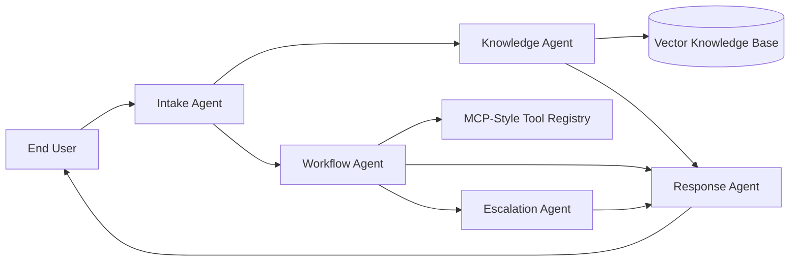

# Multi-Agent AI System for IT Support

🔗 GitHub Repository: https://github.com/Astro7101/BUS4-118S

A capstone project for an agentic IT support assistant. The system demonstrates:

- **Product-owner thinking** through scoped, high-volume IT use cases  
- **Multi-agent orchestration** with Intake, Knowledge, Workflow, Escalation, and Response agents  
- **RAG (Retrieval-Augmented Generation)** over internal IT support documentation  
- **Workflow automation** for password reset, ticket creation, and VPN diagnostics  
- **MCP-style integration** through a standardized tool registry abstraction  

---

## 🚀 Run Locally

### 1. Clone the repository
```bash
git clone https://github.com/Astro7101/BUS4-118S.git
cd BUS4-118S
```

### 2. Install dependencies
```bash
pip install -r requirements.txt
```

### 3. Run the application
```bash
uvicorn src.api.app:app --reload
```

### 4. Open in browser
```
http://localhost:8000/docs
```

---

## 📁 Repository Structure

```
BUS4-118S/
├── src/
│   ├── agents/
│   ├── api/
│   ├── core/
│   └── tools/
├── data/
├── docs/
├── scripts/
├── tests/
├── .gitignore
├── requirements.txt
└── README.md
```

---

## 🎯 Core Use Cases

1. Password reset and account lockout  
2. WiFi and network troubleshooting  
3. VPN issue triage  
4. IT ticket creation and escalation  

---

## 🏗️ Architecture



---

## ⚙️ Features

- FastAPI service with `/support`, `/health`, and `/tools`
- RAG with embeddings + FAISS for knowledge retrieval
- Fallback logic if embeddings are unavailable
- Modular agent design for clarity and scalability
- Evaluation script for demo metrics
- Unit and API testing support

---

## 🧪 Example Requests

### Password reset
```bash
curl -X POST http://localhost:8000/support \
  -H "Content-Type: application/json" \
  -d "{\"user_id\":\"jdoe\",\"message\":\"I forgot my password\"}"
```

### VPN issue
```bash
curl -X POST http://localhost:8000/support \
  -H "Content-Type: application/json" \
  -d "{\"user_id\":\"jdoe\",\"message\":\"My VPN is not connecting\"}"
```

---

## 🧪 Run Tests

```bash
pytest -q
```

---

## 📊 Run Evaluation Script

```bash
python scripts/evaluate.py
```

---

## 🎤 Presentation Talking Points

- **Problem:** Repetitive IT tickets lead to delays and inconsistent support  
- **Solution:** Multi-agent system that automates triage and resolution  
- **Architecture:** Separation of concerns improves scalability and maintainability  
- **RAG:** Responses are grounded in internal knowledge (reduces hallucination)  
- **Automation:** System can execute workflows, not just respond  
- **Scalability:** Modular design supports enterprise integration  

---

## 🔮 Roadmap

- Integrate vector databases (Pinecone, Weaviate, Chroma)  
- Add MCP integration with tools like GitHub, Jira, ServiceNow  
- Build a frontend chat interface  
- Add authentication and access control (RBAC)  
