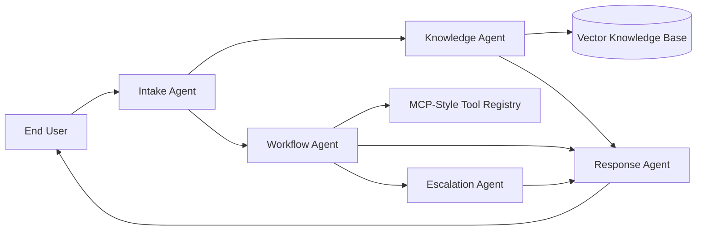

# Multi-Agent AI System for IT Support

🔗 GitHub Repository: https://github.com/Astro7101/BUS4-118S
A GitHub-ready capstone project for an agentic IT support assistant. The system demonstrates:
- **Product-owner thinking** through scoped, high-volume IT use cases
- **Multi-agent orchestration** with Intake, Knowledge, Workflow, Escalation, and Response agents
- **RAG** over internal IT support documentation
- **Workflow automation** for password reset, ticket creation, and VPN diagnostics
- **MCP-style integration** through a standardized tool registry abstraction

## Repository Structure

```
it_support_github_ready/
├── src/
│   ├── agents/
│   ├── api/
│   ├── core/
│   └── tools/
├── data/
├── docs/
├── scripts/
├── tests/
├── .env.example
├── .gitignore
├── requirements.txt
└── README.md
```

## Core Use Cases

1. Password reset and account lockout
2. WiFi and network troubleshooting
3. VPN issue triage
4. IT ticket creation and escalation

## Architecture



## Features

- FastAPI service with `/support` and `/health`
- In-memory RAG with optional embeddings + FAISS
- Lexical fallback if local embedding dependencies are unavailable
- Modular agents for easier testing and explanation during presentation
- Evaluation script for demo metrics
- Unit/API tests

## Installation

```bash
python -m venv .venv
source .venv/bin/activate
pip install -r requirements.txt
```

## Run Locally

```bash
python -m src.api.app
```

Server runs by default at `http://localhost:8000`.

## Example Requests

### Password reset
```bash
curl -X POST http://localhost:8000/support \
  -H "Content-Type: application/json" \
  -d '{"user_id":"jdoe","message":"I forgot my password and need a reset"}'
```

### WiFi problem
```bash
curl -X POST http://localhost:8000/support \
  -H "Content-Type: application/json" \
  -d '{"user_id":"jdoe","message":"My WiFi says connected but I have no internet"}'
```

### VPN issue
```bash
curl -X POST http://localhost:8000/support \
  -H "Content-Type: application/json" \
  -d '{"user_id":"jdoe","message":"My VPN keeps disconnecting this morning"}'
```

## Run Tests

```bash
pytest -q
```

## Run Evaluation Script

```bash
python scripts/evaluate.py
```

## Presentation Talking Points

- **Problem Definition:** Repetitive IT tickets create long waits and inconsistent troubleshooting.
- **Product Ownership:** Scope starts with high-volume, low-risk issues to maximize value quickly.
- **Architecture:** Separate agents improve clarity, observability, and scalability.
- **RAG:** Answers are grounded in internal troubleshooting docs instead of pure generation.
- **Workflow Automation:** The system can take action, not just respond.
- **MCP:** Tool calls use a standard interface, making future enterprise integrations easier.

## Roadmap

- Replace local KB with Pinecone, Weaviate, or Chroma
- Add real MCP server/client integration with GitHub, Jira, or ServiceNow
- Add frontend chat interface
- Add authentication, RBAC, and audit logging
